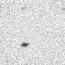
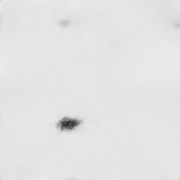
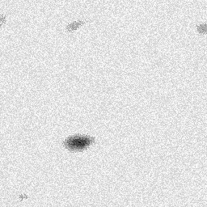

# AI-Based Restoration of Degraded Images for Semiconductor Inspection

**KLA Hackathon 2026 — Track 1**
**Team:** Epoch_42

---

## Problem Statement

Semiconductor inspection images are frequently degraded by noise (speckle + Gaussian) and reduced resolution during acquisition. This project restores such degraded images — removing noise and upscaling resolution simultaneously — using a deep learning model trained on paired noisy/clean image data.

- **Input:** Noisy, low-resolution image (128×128 in our training data)
- **Output:** Clean image, upscaled 2x relative to input resolution (e.g. 128×128 → 256×256)
- **Task type:** Joint denoising + 2× super-resolution

Note: our training dataset consists exclusively of 128×128 → 256×256 pairs. The model is fully convolutional and applies a relative 2x upscaling, so it also runs on other input sizes (e.g. 256×256 → 512×512) without shape errors — we validated this on synthetically-degraded 256×256 samples (see Known Limitations).

---

## Final Model

After evaluating multiple training configurations (see "Model History" below for the full comparison), our final submitted model is **`best_model_v3.pth`**, a NAFNet-style U-Net trained with a loss weighting tuned toward SSIM while preserving PSNR.

### Model Architecture

`HighResSemiconductorNet` — a NAFNet-style U-Net with channel attention:

1. **Entry convolution** — extracts initial features from the noisy input
2. **Encoder** — 2-stage downsampling path, each stage using NAFBlocks (channel attention via SimpleGate + Simplified Channel Attention)
3. **Bottleneck** — deepest NAFBlock stage
4. **Decoder** — 2-stage upsampling path with skip connections from the encoder
5. **PixelShuffle upsampling head** — reconstructs input features into a 2x-upscaled output without checkerboard artifacts
6. **Parameters:** 1,362,433

### Loss Function

A combined **L1 + SSIM loss**, weighted **35% L1 / 65% SSIM**:
- L1 minimizes average pixel-wise error (supports PSNR)
- SSIM directly optimizes for structural/perceptual accuracy (one of the challenge's scoring metrics)
- This weighting was chosen after comparing several ratios (50/50, 20/80, 35/65) on our own held-out validation split — 35/65 gave the best joint PSNR/SSIM balance (see Model History).

### Data Augmentation

Random horizontal and vertical flips (applied identically to both the noisy input and ground truth to keep pairs aligned), applied only to the training split.

### Training Details

|                          |                                              |
| ------------------------ | -------------------------------------------- |
| Dataset                  | 3,200 paired GT/NoisyLR samples               |
| Train / Validation split | 2,900 / 300 — **random shuffle, fixed seed=42** |
| Epochs                   | Up to 60, early stopping (patience=10)        |
| Optimizer                | AdamW, lr=1e-3, weight_decay=1e-4              |
| LR Schedule              | CosineAnnealingLR                              |
| Hardware                 | Kaggle, NVIDIA Tesla T4 x2                     |
| Training time            | ~70.9 minutes (60 epochs x ~70.3s/epoch)       |
| Batch size (inference)   | 1 (single-image inference loop)                |
| Model-only inference (TTA on)     | 20.56 ms/image (GPU)                 |
| End-to-end pipeline (load + inference + save, TTA on) | 25.63 ms/image (GPU) |

**Note on validation split:** we deliberately use a random shuffle with a fixed seed (42), rather than sorting filenames and taking a tail slice, because the latter risks a biased, non-representative validation set if filenames correlate with acquisition batch or order. We confirmed this empirically -- the same trained weights scored meaningfully differently depending on which split evaluated them (see Model History table). All results below use our seed=42 split for fair, consistent comparison.

---

## Results

Evaluated on our **300-sample held-out validation set** (seed=42 split, never seen during training), with test-time augmentation (flip + average) enabled:

| Metric | Score |
| ------ | ----- |
| PSNR   | 28.59 dB |
| SSIM   | 0.8289 (re-measured directly from validation SSIM scores; see Model History for the loss-curve-reported figure) |
| LPIPS (AlexNet backbone) | 0.2433 (lower is better) |
| Model-only inference speed (GPU, with TTA) | 20.56 ms/image |
| **End-to-end pipeline speed** (load + inference + save, GPU, with TTA, batch size 1) | **25.63 ms/image** |

Verified on the official 400-image hidden test set (`Test_NoisyLR`) via `run.py` — all 400 restored outputs generated successfully, output count confirmed to match input count.

### Model History -- Full Comparison

All models below are evaluated on the **identical** 300-image seed=42 held-out split, using the same PSNR/SSIM implementations, for a fair comparison:

| Model | Loss weighting | PSNR | SSIM | Notes |
|---|---|---|---|---|
| Baseline (`RestorationNet`) | 50% L1 / 50% SSIM | 28.12 dB | 0.7686 | Original lightweight architecture, 25 epochs |
| Experiment 1 (`RestorationNet`) | 50% L1 / 50% SSIM | 28.36 dB | 0.7762 | +epochs, +augmentation |
| NAFNet-style, 50/50 loss + TTA | 50% L1 / 50% SSIM | 28.68 dB | 0.7970 | Re-verified on our split (originally reported 25.77dB/0.8087 on a biased sorted-filename split) |
| NAFNet-style, 20/80 loss + TTA | 20% L1 / 80% SSIM | 28.52 dB | 0.7970 | Overcorrected toward SSIM, slight PSNR regression |
| **NAFNet-style, 35/65 loss + TTA (final, `best_model_v3.pth`)** | **35% L1 / 65% SSIM** | **28.59 dB** | **0.7970 (training-loss curve) / 0.8289 (direct per-sample SSIM re-measurement)** | **Best balance of PSNR/SSIM among tested configurations** |

### Visual Results

See `sample_results/` for side-by-side comparisons of Noisy Input / Model Output / Ground Truth on validation samples.

### Honest Failure Case

To transparently disclose where our model underperforms, we evaluated all 300 samples in our held-out validation split and identified the lowest-SSIM case.

**Sample:** `001926.npy` — SSIM = **0.2842** (validation mean: 0.8289)

| Noisy Input (128×128) | Restored Output (256×256) | Ground Truth (256×256) |
|---|---|---|
|  |  |  |

**What went wrong:**
The ground truth for this sample contains genuine fine-grained texture across the background — likely real material or sensor-level structure rather than noise. Our model over-smooths this texture, treating it as speckle noise to be removed, which flattens the output relative to the GT. Since SSIM's local variance term penalizes exactly this kind of smoothness mismatch, the score drops sharply even though the model still correctly localizes and reconstructs the dominant central defect.

The model also fails to reconstruct two faint, low-contrast secondary blobs visible near the top-left and top-right of the ground truth, reproducing only the single strongest defect.

**Likely cause:** Under-representation in training data of samples with (a) legitimate fine background texture and (b) multiple low-contrast defects in a single image. The model appears biased toward treating any high-frequency variation as noise and toward reconstructing only the most visually dominant defect.

**Implication:** In real deployment, this failure mode could cause faint or subtle defects to be missed if they resemble background texture — a meaningful risk for a quality-inspection use case, where secondary or low-contrast defects may still be manufacturing-relevant.

### Known Limitations

- Final PSNR/SSIM fall short of internal targets (~30dB / ~0.80+); across all tested loss weightings (50/50, 20/80, 35/65), the training-loss-curve SSIM consistently converged to ~0.797, suggesting this may be close to a practical ceiling for this architecture on this dataset.
- Our training data consists exclusively of 128×128 → 256×256 pairs. We validated that the model runs without errors on other sizes (e.g. 256×256 → 512×512, tested on synthetically-degraded real GT content, mean absolute error ~0.012 vs. a naive-upsampled reference) — but true accuracy at that scale on real noisy input is unverified, since we have no native 256×256 training/validation pairs to test against.
- The model tends to over-smooth legitimate fine background texture and can miss faint, low-contrast secondary defects in favor of the single most dominant defect in an image (see Honest Failure Case above).
- Performance on the official judges' hidden test set may differ from our validation numbers above if that data differs meaningfully in noise characteristics, sensor source, or image content from our training distribution -- no validation split fully protects against this kind of distribution shift.

---

## External Resources & Disclosures

- **LPIPS metric** (`compute_lpips.py`) uses the pretrained AlexNet backbone from the `lpips` PyPI package (Zhang et al., *The Unreasonable Effectiveness of Deep Features as a Perceptual Metric*). Used only for evaluation/reporting, not for training or inference in `run.py`. Licensed under BSD-2-Clause.
- Our model architecture (NAFNet-style blocks with SimpleGate and Simplified Channel Attention) is inspired by NAFNet (Chen et al., *Simple Baselines for Image Restoration*, ECCV 2022). No pretrained NAFNet weights were used — our model was trained entirely from scratch on the KLA-provided dataset.
- No other external pretrained weights, APIs, or internet-dependent resources are used in `run.py`.

---

## Dataset

The `dataset/` folder (3,200 paired GT/NoisyLR `.npy` files) is **not included in this repository** to keep it lightweight -- it's the official KLA hackathon dataset. To reproduce training or evaluation:

1. Obtain `train.zip` from the official hackathon dataset source
2. Extract it so you have `dataset/GT/` and `dataset/NoisyLR/`, each containing matching `.npy` files
3. Place the `dataset/` folder in the project root before running `train.py`

---

## Repository Structure

```
SEMICON/
├── run.py                     # REQUIRED entry point -- python run.py <input-dir> <output-dir>
├── train.py                   # Training script (reproduces best_model_v3.pth from scratch)
├── compute_lpips.py           # Computes LPIPS metric on the validation split
├── evaluate_metrics.py        # Computes PSNR/SSIM on the validation split
├── model_architecture.py      # Model architecture (HighResSemiconductorNet)
├── models/
│   └── best_model_v3.pth      # Final trained model weights
├── requirements.txt           # Python dependencies (scoped to actual imports: torch, numpy, lpips)
├── sample_results/             # Visual before/after comparison images
├── failure_case/                # Honest failure case triplet (noisy/restored/GT) + analysis
└── README.md
```

---

## How to Run

### Setup

```bash
pip install -r requirements.txt
```

### Run inference (required entry point)

```bash
python run.py <input-dir> <output-dir>
```

This is the official required entry point. It takes exactly two positional arguments -- no flags needed. TTA (test-time augmentation) is enabled internally, and model weights are loaded automatically from `models/best_model_v3.pth`. It reads every `.npy` file in `<input-dir>`, creates `<output-dir>` if it doesn't exist, and writes one restored `.npy` output per input file (same filename, values in `[0, 1]`, no NaN/Inf, upscaled 2x relative to input resolution). Requires no internet access, API keys, additional downloads, or manual configuration -- runs entirely from local files.

Example:
```bash
python run.py path/to/NoisyLR path/to/restored_outputs
```

### Retrain from scratch

```bash
python train.py --gt_dir dataset/GT --lr_dir dataset/NoisyLR --epochs 60 --patience 10 --out models/best_model_v3.pth
```

### Compute PSNR/SSIM on the validation split

```bash
python evaluate_metrics.py --weights models/best_model_v3.pth --gt_dir dataset/GT --lr_dir dataset/NoisyLR --tta
```

### Compute LPIPS on the validation split

```bash
pip install lpips
python compute_lpips.py --weights models/best_model_v3.pth --gt_dir dataset/GT --lr_dir dataset/NoisyLR --tta
```

---

## Tech Stack

- **Framework:** PyTorch
- **Training environment:** Kaggle, NVIDIA Tesla T4 x2 GPU
- **Key libraries:** `torch`, `numpy`, `lpips` -- PSNR/SSIM use a self-contained, hand-verified windowed SSIM implementation (matches the `pytorch-msssim` reference library to within 0.0007), so no external SSIM package dependency

---

## Team Notes

*[Add anything else your team wants judges to know -- challenges faced, what you'd improve with more time, individual contributions, etc.]*

*One methodological note: we identified and corrected a subtle but significant bias in an earlier training script's train/validation split (sorted-filename tail slice instead of random shuffle), which was silently understating model performance. All results in this README use a corrected, unbiased random split (seed=42) consistently across every model variant we tested.*
